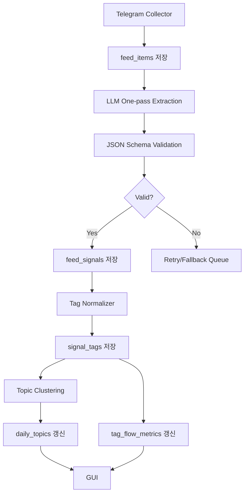

# Market Radar Desktop 개발계획서

## 1. 제품 개요

### 1.1 제품명

**Market Radar Desktop**

텔레그램 주식 채널에서 실시간으로 쏟아지는 피드를 수집하고, LLM을 통해 주제·주요내용·태그·중요도·관심분야 연관성 점수를 구조화한 뒤, 정규화된 DB에 저장하고 흐름 변화를 분석하는 윈도우 데스크톱 앱.

---

## 2. 제품 목표

### 2.1 핵심 목표

사용자가 여러 텔레그램 주식 채널을 계속 직접 읽지 않아도, 다음 정보를 빠르게 파악할 수 있게 한다.

1. 지금 새로 들어온 중요한 피드
2. 내 관심 종목·산업과 관련 있는 피드
3. 어떤 주제와 태그가 오늘 더 중요해지고 있는지
4. 특정 태그나 주제가 과거 대비 어떻게 변하고 있는지
5. 날짜별 핵심 주제와 해당 주제의 요약
6. 각 요약의 원문 확인

### 2.2 제품의 본질

이 앱은 단순 “텔레그램 요약기”가 아니다.

**실시간 주식 피드 구조화 + 태그 정규화 + 흐름 감지 + 원문 검증 + 주제 분석 워크벤치**다.

### 2.3 사용자 경험 목표

사용자는 앱을 열었을 때 다음 순서로 정보를 파악할 수 있어야 한다.

1. 오늘 들어온 피드 중 가장 중요한 것
2. 내 관심분야와 관련성이 높은 것
3. 지금 올라오는 주제와 태그
4. 특정 주제의 최근 흐름
5. 원문 검증

---

## 3. 핵심 사용 시나리오

### 3.1 실시간 모니터링

사용자는 앱을 켜두고 텔레그램 채널에서 수집되는 피드를 실시간 DB 피드 화면에서 본다.

각 행에는 다음 정보가 표시된다.

| 항목 | 설명 |
|---|---|
| 시간 | 피드 수집 시각 |
| 채널 | 텔레그램 채널명 |
| 주제 | LLM이 추출한 12자 이내 주제 |
| 주요내용 | 50자 이내 핵심 내용 |
| 태그 | 정규화된 기업·인물·산업 태그 |
| 중요도 | 0~100 |
| 관심도 | 0~100 |
| 원문 | 원문 팝업 버튼 |

사용자는 점수, 태그, 주제 기준으로 정렬하거나 필터링할 수 있다.

---

### 3.2 원문 확인

실시간 DB 피드의 각 행에는 **원문 보기 버튼**이 있다.

버튼을 누르면 팝업으로 다음 내용을 보여준다.

- 원문 텔레그램 메시지
- 채널명
- 수집 시각
- 메시지 링크
- LLM 추출 결과
- 정규화 태그
- 중요도/관심도 점수

요약만 보고 판단하지 않고, 반드시 원문을 확인할 수 있게 한다.

---

### 3.3 흐름 대시보드

사용자는 흐름 대시보드에서 다음을 확인한다.

- 최근 7일/14일/30일 태그별 언급량 변화
- 태그별 평균 중요도 변화
- 태그별 평균 관심도 변화
- 급상승 태그
- 새로 등장한 주제
- 같은 주제가 며칠째 확산되고 있는지
- 오늘 특히 중요도가 올라온 주제

예시:

| 태그 | 6/18 | 6/19 | 6/20 | 6/21 | 6/22 | 6/23 | 6/24 | 변화 |
|---|---:|---:|---:|---:|---:|---:|---:|---|
| HBM | 31 | 34 | 48 | 51 | 66 | 88 | 92 | 강한 상승 |
| 반도체테스트 | 16 | 22 | 29 | 44 | 57 | 73 | 86 | 강한 상승 |
| 유리기판 | 12 | 21 | 28 | 41 | 32 | 68 | 78 | 상승 |
| 동박 | 18 | 15 | 24 | 27 | 31 | 44 | 54 | 초기 상승 |

---

### 3.4 일자별 핵심 주제 확인

사용자는 특정 날짜를 선택해 그날의 핵심 주제를 볼 수 있다.

각 날짜별로 다음을 저장한다.

- 일자
- 핵심 주제 순위
- 주제명
- 대표 주요내용
- 대표 태그
- 관련 피드 수
- 총 중요도
- 총 관심도
- 대표 원문 피드 목록

예시:

```text
2026-06-24

1. HBM테스트
HBM 공급부족 피드가 테스트·검사 병목으로 확장.
관련 태그: SK하이닉스, HBM, 반도체테스트, ISC

2. 유리기판
SKC, 삼성전기 관련 코멘트 재확산.
관련 태그: SKC, 삼성전기, 유리기판

3. 전력기기
AI 데이터센터 전력설비 발주 기대 유지.
관련 태그: 전력기기, 데이터센터, 변압기
```

---

### 3.5 태그/주제 분석 요청

사용자가 특정 태그나 주제에서 **분석 요청** 버튼을 누르면 앱은 최근 피드들을 모아 LLM 분석을 실행한다.

분석 입력:

- 분석 대상 태그 또는 주제
- 기간: 최근 7일, 14일, 30일
- 관련 feed_signals
- 원문 일부
- 일자별 score 변화
- 태그 흐름 지표

분석 결과:

- 최근 흐름 요약
- 날짜별 변화
- 과거 대비 최근 차이
- 중요도가 올라간 이유
- 관심분야와의 연결성
- 확인해야 할 원문/근거
- 아직 불확실한 부분

---

## 4. 앱 형태

### 4.1 앱 유형

**윈도우 데스크톱 앱**

웹앱 느낌의 카드형 UI보다, 정보 밀도가 높은 전문 데스크톱 툴을 지향한다.

### 4.2 권장 기술 스택

| 영역 | 권장 |
|---|---|
| App Shell | Tauri |
| Frontend | React + TypeScript |
| Backend | Rust 또는 Node.js sidecar |
| Local DB | SQLite |
| Search Index | SQLite FTS5 |
| Vector Search, 선택 | LanceDB 또는 sqlite-vss |
| Telegram 수집 | TDLib 또는 user-authorized Telegram client layer |
| LLM API | OpenAI-compatible API |
| Chart | lightweight chart/table components |
| Packaging | Windows installer |

### 4.3 왜 데스크톱 앱인가

1. 장시간 켜두는 모니터링 앱에 적합
2. 로컬 DB 저장이 쉬움
3. 원문/요약/흐름/분석을 고밀도 화면으로 표시 가능
4. 단축키, 다중 패널, 테이블 중심 UI에 적합
5. 사용자가 민감한 관심종목과 피드 데이터를 로컬에 저장할 수 있음

---

## 5. GUI 설계

### 5.1 전체 레이아웃

```text
┌──────────────────────────────────────────────────────────────┐
│ Title Bar: Market Radar Desktop                              │
├──────────────────────────────────────────────────────────────┤
│ Toolbar: 검색 / 필터 / 동기화 / 분석 요청 / 상태 표시         │
├──────────────┬────────────────────────────────┬──────────────┤
│ Left Nav     │ Main Pane                       │ Right Pane    │
│              │                                │              │
│ 실시간 DB    │ 선택된 탭의 메인 콘텐츠          │ 오늘 지표      │
│ 흐름 대시보드 │                                │ 상위 태그      │
│ 일자별 주제   │                                │ 시스템 상태    │
│ 태그 분석     │                                │ 즉시 확인      │
│ 주제 클러스터 │                                │              │
│ 프롬프트      │                                │              │
│ 설정          │                                │              │
└──────────────┴────────────────────────────────┴──────────────┘
```

### 5.2 디자인 원칙

1. 둥글고 예쁜 카드형 UI를 지양한다.
2. 전문 터미널/트레이딩 툴 느낌의 고밀도 UI를 지향한다.
3. 표, 분할 패널, 상태바, 단축키를 적극 사용한다.
4. 한 화면에 많은 정보를 보여주되, 색상은 최소화한다.
5. 색상은 의미가 있을 때만 사용한다.
   - 빨강: 중요도 매우 높음
   - 노랑: 중간 이상
   - 파랑: 일반 정보
   - 회색: 낮은 중요도/노이즈
6. 사용자는 요약을 보되 언제든 원문을 확인할 수 있어야 한다.

---

## 6. 탭 구성

### 6.1 실시간 DB 피드 탭

가장 중요한 메인 화면.

#### 표시 컬럼

| 컬럼 | 설명 |
|---|---|
| 시간 | 수집 시각 |
| 채널 | 텔레그램 채널명 |
| 주제 | 12자 이내 |
| 주요내용 | 50자 이내 |
| 태그 | 정규화 태그 |
| 중요도 | 0~100 |
| 관심도 | 0~100 |
| 원문 | 팝업 버튼 |

#### 기능

- 실시간 업데이트
- 정렬
  - 시간순
  - 중요도순
  - 관심도순
  - 채널순
  - 태그순
- 필터
  - 관심 태그만
  - 특정 채널만
  - 중요도 80 이상
  - 관심도 70 이상
  - 특정 주제
- 원문 팝업
- 선택 행 고정
- 선택 피드 분석 요청

---

### 6.2 흐름 대시보드 탭

전체 피드 흐름을 파악하는 화면.

#### 표시 항목

- 태그별 일자별 score heatmap
- 태그별 언급량
- 태그별 평균 중요도
- 태그별 평균 관심도
- 상승 속도
- 가속도
- 신규 등장 태그
- 연속 상승 태그

#### 핵심 계산

```text
weighted_score = feed_count_weight + avg_importance + avg_interest
velocity = today_score - moving_average_7d
acceleration = velocity_today - velocity_yesterday
```

#### 예시 해석

```text
HBM은 단순 공급부족 피드에서 테스트 병목 주제로 세분화.
반도체테스트 태그는 전주 대비 빠르게 상승.
유리기판은 단기 확산은 빠르나 확인 가능한 원문이 제한적.
```

---

### 6.3 일자별 주제 탭

날짜별 핵심 주제를 보여주는 화면.

#### 왼쪽

- 날짜 리스트
- 각 날짜별 핵심 주제 수
- S급 또는 중요 피드 수

#### 오른쪽

- 선택 날짜의 핵심 주제 목록
- 각 주제별 요약
- 관련 태그
- 대표 피드
- 원문 보기
- 주제 분석 요청

---

### 6.4 태그/주제 분석 탭

사용자가 특정 주제나 태그를 선택해 깊게 분석하는 화면.

#### 입력

- 분석 대상
- 기간
- 피드 범위
  - 내 관심분야 중심
  - 전체 피드 기준
  - 중요도 상위 피드만
- 원문 포함 여부

#### 출력

- 5줄 요약
- 날짜별 흐름
- 과거 대비 최근 변화
- 주제의 중요도가 올라간 이유
- 관련 태그 변화
- 관련 기업/산업
- 확인해야 할 원문
- 불확실한 부분

---

### 6.5 주제 클러스터 탭

비슷한 피드를 하나의 주제로 묶어서 보는 화면.

#### 표시 컬럼

| 컬럼 | 설명 |
|---|---|
| 주제 | 클러스터 대표 주제 |
| 대표 주요내용 | 대표 피드의 50자 내용 |
| 피드 수 | 묶인 피드 수 |
| 첫 등장 | 최초 감지 시간 |
| 최근 | 마지막 감지 시간 |
| 대표 태그 | 정규화 태그 |
| 총 중요도 | 피드별 중요도 합산 |
| 총 관심도 | 피드별 관심도 합산 |

#### 목적

- 중복 제거
- 확산 강도 파악
- 같은 주제가 여러 채널에서 돌고 있는지 확인
- 일자별 핵심 주제 산출

---

### 6.6 LLM 프롬프트 탭

운영자가 실시간 피드 추출 프롬프트를 확인하고 버전 관리하는 화면.

#### 표시 항목

- 현재 프롬프트 버전
- JSON Schema
- 최근 실패율
- 재시도 횟수
- 파싱 실패 샘플
- 프롬프트 변경 이력

---

### 6.7 설정/태그사전 탭

#### 관심분야 설정

- 관심 기업
- 관심 인물
- 관심 산업
- 관심 제품/기술
- 각 항목별 가중치

#### 태그 정규화 사전

예시:

| Alias | Canonical |
|---|---|
| 하닉 | SK하이닉스 |
| SK hynix | SK하이닉스 |
| 젠슨 | 젠슨 황 |
| 유리 기판 | 유리기판 |
| 테스트소켓 | 반도체테스트 |

#### 알림 기준

- importance_score 기준
- interest_score 기준
- 특정 태그 포함 여부
- 특정 채널 제외
- 동일 주제 중복 알림 방지

---

## 7. LLM 처리 설계

### 7.1 원칙

실시간 피드 저장 단계에서는 LLM을 한 번만 호출한다.

LLM은 다음을 한 번에 생성한다.

- 주제
- 주요내용
- tags
- tag_groups
- importance_score
- interest_score
- should_alert

신규성, 루머성, 신뢰도 등은 MVP에서는 별도 필드로 두지 않는다.

### 7.2 LLM 입력

실시간 구조화 단계에서 LLM에 넣는 입력은 최소화한다.

```json
{
  "datetime": "2026-06-24T10:42:11+09:00",
  "channel_name": "채널 A",
  "message_text": "피드 원문",
  "message_url": "https://t.me/...",
  "user_interests": ["SK하이닉스", "HBM", "반도체테스트", "유리기판", "동박"]
}
```

넣지 않는 것:

- 최근 N시간 상위 주제
- 대량 태그 사전
- 긴 과거 맥락
- 채널별 장문 설명
- 전체 관심종목 universe

### 7.3 LLM 출력

```json
{
  "datetime": "2026-06-24T10:42:11+09:00",
  "channel_name": "채널 A",
  "topic": "HBM테스트",
  "main_content": "HBM 관심이 테스트 소켓과 검사 병목으로 확산",
  "tags": ["SK하이닉스", "HBM", "반도체테스트", "ISC"],
  "tag_groups": {
    "companies": ["SK하이닉스", "ISC"],
    "people": [],
    "industries": ["HBM", "반도체테스트"]
  },
  "importance_score": 92,
  "interest_score": 88,
  "should_alert": true
}
```

### 7.4 실시간 LLM 프롬프트

```text
{SYSTEM}
너는 주식 관련 텔레그램 피드를 DB에 저장 가능한 구조로 변환하는 정보 추출 엔진이다.
반드시 JSON만 출력한다. 설명문, markdown, 주석은 출력하지 않는다.

원칙:
1. 원문에 없는 사실을 만들지 않는다.
2. 투자 의견, 매수/매도 추천을 쓰지 않는다.
3. topic은 12자 이내 한국어 명사구로 쓴다.
4. main_content는 50자 이내 한국어 한 문장으로 쓴다.
5. tags는 기업, 주요 인물, 산업분야, 제품/기술 중심으로 뽑는다.
6. tags는 가능한 표준명으로 쓴다. 예: 하닉 → SK하이닉스, 젠슨 → 젠슨 황.
7. 확신이 낮아도 별도 후보/타입을 만들지 말고, 가장 그럴듯한 표준 태그명만 tags에 넣는다.
8. tag_groups에는 tags를 companies, people, industries로만 분리한다.
9. 해당 그룹이 없으면 빈 배열을 쓴다.
10. importance_score와 interest_score는 0~100 정수로 쓴다.
11. importance_score는 시장 민감도, 실적/수급/규제/공급망 관련성, 구체성, 즉시성 기준으로 판단한다.
12. interest_score는 user_interests와의 직접/간접 관련성 기준으로 판단한다.

{INPUT}
{
  "datetime": "{{datetime}}",
  "channel_name": "{{channel_name}}",
  "message_text": "{{message_text}}",
  "message_url": "{{message_url}}",
  "user_interests": {{user_interests_json}}
}

{OUTPUT_JSON_SCHEMA}
{
  "datetime": "YYYY-MM-DDTHH:mm:ss+09:00",
  "channel_name": "string",
  "topic": "string, max 12 Korean chars",
  "main_content": "string, max 50 Korean chars",
  "tags": ["string"],
  "tag_groups": {
    "companies": ["string"],
    "people": ["string"],
    "industries": ["string"]
  },
  "importance_score": 0,
  "interest_score": 0,
  "should_alert": false
}
```

---

## 8. 태그 정규화 설계

### 8.1 기본 원칙

LLM 출력의 tags는 최종값이 아니다.

LLM이 추출한 tags를 후처리 레이어에서 canonical tag로 매핑한다.

### 8.2 정규화 방식

1. 정확 매칭
2. alias 매칭
3. 대소문자/공백/특수문자 제거 매칭
4. 초성/약칭 룰
5. 유사도 매칭
6. 미등록 태그 후보 저장
7. 운영자 승인 후 canonical_tags 등록

### 8.3 canonical_tags 테이블

| 필드 | 설명 |
|---|---|
| tag_id | 태그 ID |
| canonical_name | 표준명 |
| tag_group | company, person, industry |
| aliases | 별칭 배열 |
| ticker | 종목코드 |
| sector | 산업 |
| parent_tag_id | 상위 태그 |

### 8.4 예시

| LLM tag | Canonical | Group |
|---|---|---|
| 하닉 | SK하이닉스 | company |
| SK hynix | SK하이닉스 | company |
| 젠슨 | 젠슨 황 | person |
| 유리 기판 | 유리기판 | industry |
| 테스트소켓 | 반도체테스트 | industry |

---

## 9. DB 설계

### 9.1 feed_items

원문 저장 테이블.

```sql
CREATE TABLE feed_items (
  id INTEGER PRIMARY KEY AUTOINCREMENT,
  datetime TEXT NOT NULL,
  channel_name TEXT NOT NULL,
  message_text TEXT NOT NULL,
  message_url TEXT,
  raw_hash TEXT UNIQUE,
  collected_at TEXT NOT NULL
);
```

### 9.2 llm_extractions

LLM 원본 결과 저장.

```sql
CREATE TABLE llm_extractions (
  id INTEGER PRIMARY KEY AUTOINCREMENT,
  feed_id INTEGER NOT NULL,
  prompt_version TEXT NOT NULL,
  raw_json TEXT NOT NULL,
  parsed_ok INTEGER NOT NULL,
  error_message TEXT,
  created_at TEXT NOT NULL,
  FOREIGN KEY(feed_id) REFERENCES feed_items(id)
);
```

### 9.3 feed_signals

실시간 DB 피드 화면의 메인 테이블.

```sql
CREATE TABLE feed_signals (
  id INTEGER PRIMARY KEY AUTOINCREMENT,
  feed_id INTEGER NOT NULL,
  date TEXT NOT NULL,
  channel_name TEXT NOT NULL,
  topic TEXT NOT NULL,
  main_content TEXT NOT NULL,
  importance_score INTEGER NOT NULL,
  interest_score INTEGER NOT NULL,
  should_alert INTEGER NOT NULL,
  created_at TEXT NOT NULL,
  FOREIGN KEY(feed_id) REFERENCES feed_items(id)
);
```

### 9.4 canonical_tags

표준 태그 사전.

```sql
CREATE TABLE canonical_tags (
  id INTEGER PRIMARY KEY AUTOINCREMENT,
  canonical_name TEXT NOT NULL,
  tag_group TEXT NOT NULL,
  aliases TEXT,
  ticker TEXT,
  sector TEXT,
  parent_tag_id INTEGER,
  created_at TEXT NOT NULL
);
```

### 9.5 signal_tags

피드와 정규화 태그 연결.

```sql
CREATE TABLE signal_tags (
  id INTEGER PRIMARY KEY AUTOINCREMENT,
  feed_id INTEGER NOT NULL,
  signal_id INTEGER NOT NULL,
  canonical_tag_id INTEGER NOT NULL,
  canonical_name TEXT NOT NULL,
  tag_group TEXT NOT NULL,
  normalize_confidence REAL,
  created_at TEXT NOT NULL,
  FOREIGN KEY(feed_id) REFERENCES feed_items(id),
  FOREIGN KEY(signal_id) REFERENCES feed_signals(id),
  FOREIGN KEY(canonical_tag_id) REFERENCES canonical_tags(id)
);
```

### 9.6 topic_clusters

유사 주제 묶음.

```sql
CREATE TABLE topic_clusters (
  id INTEGER PRIMARY KEY AUTOINCREMENT,
  topic TEXT NOT NULL,
  canonical_tags TEXT,
  first_seen_at TEXT NOT NULL,
  last_seen_at TEXT NOT NULL,
  feed_count INTEGER NOT NULL,
  cluster_score REAL NOT NULL,
  created_at TEXT NOT NULL,
  updated_at TEXT NOT NULL
);
```

### 9.7 daily_topics

일자별 핵심 주제.

```sql
CREATE TABLE daily_topics (
  id INTEGER PRIMARY KEY AUTOINCREMENT,
  date TEXT NOT NULL,
  topic_cluster_id INTEGER NOT NULL,
  daily_rank INTEGER NOT NULL,
  summary TEXT NOT NULL,
  representative_feed_ids TEXT NOT NULL,
  total_score REAL NOT NULL,
  created_at TEXT NOT NULL,
  FOREIGN KEY(topic_cluster_id) REFERENCES topic_clusters(id)
);
```

### 9.8 tag_flow_metrics

태그별 흐름 지표.

```sql
CREATE TABLE tag_flow_metrics (
  id INTEGER PRIMARY KEY AUTOINCREMENT,
  tag_id INTEGER NOT NULL,
  date TEXT NOT NULL,
  feed_count INTEGER NOT NULL,
  avg_importance REAL NOT NULL,
  avg_interest REAL NOT NULL,
  velocity REAL NOT NULL,
  acceleration REAL NOT NULL,
  created_at TEXT NOT NULL,
  FOREIGN KEY(tag_id) REFERENCES canonical_tags(id)
);
```

---

## 10. 데이터 처리 파이프라인

### 10.1 전체 흐름



### 10.2 실시간 처리

1. 텔레그램 메시지 수집
2. raw_hash 계산
3. 중복 원문이면 skip
4. feed_items 저장
5. LLM one-pass 호출
6. JSON 검증
7. 실패 시 retry
8. 실패 지속 시 fallback 저장
9. feed_signals 저장
10. tags 정규화
11. signal_tags 저장
12. topic_clusters 갱신
13. tag_flow_metrics 갱신
14. GUI 이벤트 전송

### 10.3 Micro-batch

피드가 매우 많을 경우 1건씩 LLM 호출하지 않고 5~10건 단위로 micro-batch 처리할 수 있다.

단, 출력 JSON은 각 피드별 item으로 분리되어야 한다.

---

## 11. 점수화 설계

### 11.1 importance_score

중요도 점수.

기준:

| 요소 | 설명 |
|---|---|
| 시장 민감도 | 주가에 영향을 줄 가능성 |
| 구체성 | 숫자, 기업명, 이벤트가 구체적인가 |
| 실적 영향 | 매출, 이익, 수주, 가격과 연결되는가 |
| 공급망 영향 | 병목, 증설, 납기, 고객사 변화와 연결되는가 |
| 즉시성 | 오늘 또는 단기적으로 확인해야 하는가 |
| 반복 확산 | 여러 채널에서 비슷한 내용이 반복되는가 |

MVP에서는 LLM이 1차 점수를 부여한다.

이후 고도화에서는 시스템 점수를 추가할 수 있다.

```text
final_importance =
  llm_importance * 0.7
  + cluster_spread_score * 0.2
  + source_weight * 0.1
```

### 11.2 interest_score

관심분야 연관성 점수.

기준:

| 요소 | 설명 |
|---|---|
| 직접 매칭 | 관심 종목/태그가 직접 등장 |
| 산업 매칭 | 관심 산업과 관련 |
| 밸류체인 매칭 | 관심 종목의 공급망과 연결 |
| 과거 분석 이력 | 사용자가 자주 분석한 주제와 유사 |
| 가중치 | 사용자가 설정한 관심도 |

MVP에서는 user_interests 짧은 리스트를 LLM 입력에 넣어 점수화한다.

고도화에서는 정규화 태그 기반으로 시스템 재계산한다.

---

## 12. 알림 설계

### 12.1 기본 알림 조건

```text
importance_score >= 80
AND interest_score >= 70
AND 동일 topic_cluster에서 최근 30분 내 알림 없음
```

### 12.2 알림 내용

```text
[S] HBM테스트
HBM 관심이 테스트 소켓과 검사 병목으로 확산

태그: SK하이닉스, HBM, 반도체테스트, ISC
중요도 92 / 관심도 88
원문 보기
```

### 12.3 알림 과잉 방지

- 동일 주제 클러스터는 묶어서 알림
- 같은 채널의 반복 메시지는 점수 낮춤
- 원문 hash 중복 제거
- 짧은 시간 내 같은 태그 과다 알림 제한

---

## 13. 원문 팝업 설계

### 13.1 팝업 내용

- 제목: 시간 · 채널 · 주제
- 원문 텍스트
- 메시지 링크
- LLM 저장값
- 정규화 태그
- 중요도/관심도
- 복사 버튼
- 원문 열기 버튼
- 닫기 버튼

### 13.2 UX

- 실시간 DB 피드의 `보기` 버튼 클릭
- Enter로 선택 행 열기
- Esc로 닫기
- 팝업에서 분석 요청 가능

---

## 14. 검색/필터링

### 14.1 검색

검색 대상:

- 원문
- 주제
- 주요내용
- 태그
- 채널명

SQLite FTS5 사용.

### 14.2 필터

- 날짜
- 채널
- 태그
- 주제
- 중요도 범위
- 관심도 범위
- should_alert 여부
- 원문 포함 검색

### 14.3 정렬

- 최신순
- 중요도순
- 관심도순
- 채널순
- 태그순
- 주제별 묶음순

---

## 15. 분석 요청 기능

### 15.1 입력 데이터 구성

사용자가 특정 태그/주제 분석을 요청하면 앱은 다음 데이터를 구성한다.

```json
{
  "target": "HBM테스트",
  "period": "recent_7d",
  "feeds": [
    {
      "date": "2026-06-24",
      "topic": "HBM테스트",
      "main_content": "HBM 관심이 테스트 소켓과 검사 병목으로 확산",
      "tags": ["SK하이닉스", "HBM", "반도체테스트", "ISC"],
      "importance_score": 92,
      "interest_score": 88,
      "raw_text": "원문 일부"
    }
  ],
  "daily_metrics": [
    {
      "date": "2026-06-24",
      "feed_count": 42,
      "avg_importance": 84,
      "avg_interest": 79
    }
  ]
}
```

### 15.2 출력 형식

```text
[5줄 요약]
- ...
- ...
- ...
- ...
- ...

[날짜별 흐름]
6/18
- ...

6/21
- ...

6/24
- ...

[최근 변화]
과거에는 HBM 공급부족 중심이었으나 최근에는 테스트 병목과 소켓/검사 공정으로 관심이 이동.

[확인 필요]
- 공식 수주 여부
- 실적 추정치 반영 여부
- 실제 주가/거래량 반응
- 원문 출처 신뢰도
```

---

## 16. 개발 단계

### Phase 0. 기술 검증

목표: 핵심 리스크 확인.

작업:

1. 텔레그램 수집 가능성 검증
2. 메시지 원문 저장
3. LLM one-pass JSON 추출 검증
4. JSON schema validation
5. SQLite 저장
6. 간단한 테이블 UI 표시
7. 원문 팝업 구현

산출물:

- CLI 또는 간단한 데스크톱 프로토타입
- 샘플 DB
- LLM 추출 성공률 기록
- 실패 케이스 목록

---

### Phase 1. MVP

목표: 실제 사용할 수 있는 최소 기능 앱.

기능:

1. 텔레그램 채널 수집
2. feed_items 저장
3. LLM one-pass extraction
4. feed_signals 저장
5. tags 정규화
6. 실시간 DB 피드 탭
7. 원문 팝업
8. 기본 검색/필터
9. 흐름 대시보드 기본형
10. 일자별 주제 기본형
11. 태그/주제 분석 요청
12. 설정/관심분야 관리

완료 기준:

- 하루 수천 개 피드 처리 가능
- LLM 구조화 성공률 95% 이상
- 원문 팝업 정상 동작
- 관심분야 관련 피드가 상위에 노출
- 날짜별 핵심 주제 저장 가능

---

### Phase 2. 고도화

목표: 분석 품질과 운영 안정성 강화.

기능:

1. topic clustering 고도화
2. 중복 제거 고도화
3. 채널별 가중치
4. 사용자 관심도 모델 개선
5. 태그 사전 편집 UI
6. 알림 정책 개선
7. 피드 재처리 기능
8. LLM 프롬프트 A/B 테스트
9. 기간별 흐름 비교
10. 주가/거래량 데이터 연결

---

### Phase 3. 리서치 워크벤치

목표: 투자 리서치 도구로 확장.

기능:

1. 종목별 피드 타임라인
2. 테마별 피드 타임라인
3. 주제 변화 리포트
4. 내러티브 변화 감지
5. 주가 반응 연결
6. 공시/뉴스 교차검증
7. 사용자 메모
8. export
   - CSV
   - Markdown
   - HTML
   - PDF
9. 팀 공유

---

## 17. 개발 우선순위

### 1순위

- Telegram ingest
- feed_items 저장
- LLM one-pass extraction
- JSON validation
- feed_signals 저장
- 실시간 DB 피드 GUI
- 원문 팝업

### 2순위

- 태그 정규화
- 관심분야 점수 계산
- 검색/필터
- 일자별 주제
- 흐름 대시보드

### 3순위

- 주제 클러스터링
- 분석 요청
- 알림
- 태그 사전 편집
- 프롬프트 관리

### 4순위

- 주가/거래량 연동
- 리포트 export
- 팀 기능
- 자동 리서치 요약

---

## 18. 폴더 구조 제안

```text
market-radar-desktop/
  README.md
  package.json
  src-tauri/
    tauri.conf.json
    Cargo.toml
    src/
      main.rs
      commands/
        feed.rs
        settings.rs
        analysis.rs
      db/
        mod.rs
        migrations/
      telegram/
        collector.rs
      llm/
        extractor.rs
        prompts.rs
      normalize/
        tags.rs
      analytics/
        flow.rs
        cluster.rs
  src/
    main.tsx
    App.tsx
    styles/
      globals.css
      desktop.css
    components/
      layout/
        TitleBar.tsx
        Toolbar.tsx
        LeftNav.tsx
        RightPane.tsx
      feed/
        LiveFeedTable.tsx
        RawFeedModal.tsx
        FeedFilters.tsx
      flow/
        FlowDashboard.tsx
        HeatmapTable.tsx
      daily/
        DailyTopics.tsx
      analysis/
        TopicAnalysis.tsx
      settings/
        TagDictionary.tsx
        InterestSettings.tsx
        PromptSettings.tsx
    lib/
      api.ts
      types.ts
      format.ts
    store/
      appStore.ts
  prompts/
    feed_extract_v0.1.txt
    topic_analysis_v0.1.txt
  data/
    market_radar.sqlite
  docs/
    development_plan.md
```

---

## 19. 주요 모듈 설계

### 19.1 Telegram Collector

역할:

- 채널 메시지 수집
- 중복 hash 계산
- feed_items 저장
- 수집 상태 관리

### 19.2 LLM Extractor

역할:

- 프롬프트 생성
- LLM API 호출
- JSON parsing
- schema validation
- retry/fallback

### 19.3 Tag Normalizer

역할:

- LLM tags를 canonical_tags로 매핑
- alias 처리
- 미등록 태그 후보 저장
- signal_tags 생성

### 19.4 Flow Analytics

역할:

- 태그별 일자 지표 계산
- velocity/acceleration 계산
- 급상승 태그 산출
- 흐름 대시보드 데이터 제공

### 19.5 Topic Cluster

역할:

- 같은 주제 피드 묶기
- topic_clusters 업데이트
- daily_topics 생성
- 중복 알림 방지

### 19.6 GUI

역할:

- 실시간 DB 피드 표시
- 원문 팝업
- 흐름 대시보드
- 일자별 주제
- 분석 요청
- 설정/태그사전 관리

---

## 20. API/Command 설계

Tauri command 기준 예시.

```ts
getLiveFeeds(filter): FeedSignal[]
getRawFeed(feedId): FeedItem
getTagFlowMetrics(range): TagFlowMetric[]
getDailyTopics(date): DailyTopic[]
runTopicAnalysis(target, range): AnalysisResult
updateUserInterests(interests): void
getCanonicalTags(): CanonicalTag[]
upsertCanonicalTag(tag): void
```

---

## 21. 타입 정의 예시

```ts
export type FeedSignal = {
  id: number;
  feedId: number;
  datetime: string;
  channelName: string;
  topic: string;
  mainContent: string;
  tags: string[];
  companies: string[];
  people: string[];
  industries: string[];
  importanceScore: number;
  interestScore: number;
  shouldAlert: boolean;
};

export type FeedItem = {
  id: number;
  datetime: string;
  channelName: string;
  messageText: string;
  messageUrl?: string;
};

export type TagFlowMetric = {
  tagId: number;
  canonicalName: string;
  date: string;
  feedCount: number;
  avgImportance: number;
  avgInterest: number;
  velocity: number;
  acceleration: number;
};

export type DailyTopic = {
  date: string;
  topic: string;
  rank: number;
  summary: string;
  tags: string[];
  representativeFeedIds: number[];
  totalScore: number;
};
```

---

## 22. 성능 고려사항

### 22.1 실시간 처리

- LLM 호출은 비동기 큐로 처리
- GUI는 수집과 LLM 처리 상태를 분리 표시
- 수집은 계속되고 LLM이 밀리면 queue length 표시
- 실패 피드는 fallback 저장 후 나중에 재처리

### 22.2 DB

- feed_items.raw_hash unique index
- feed_signals.date index
- signal_tags.canonical_tag_id index
- tag_flow_metrics(tag_id, date) index
- FTS5 원문 검색 index

### 22.3 UI

- 실시간 테이블은 virtualized table 사용
- 1만 행 이상에서도 스크롤 성능 유지
- 원문은 행 클릭 시 lazy load
- 차트보다 표/heatmap 우선

---

## 23. 리스크와 대응

### 23.1 텔레그램 수집 리스크

리스크:

- 채널 접근 권한
- 계정 인증
- rate limit
- 정책 문제

대응:

- 초기에는 사용자가 직접 접근 가능한 채널만 수집
- 수집 모듈을 독립화
- 수집 실패 로그 표시
- 채널별 on/off 제공

### 23.2 LLM 출력 불안정

리스크:

- JSON 파싱 실패
- 50자 제한 초과
- 점수 과대평가
- 태그명 흔들림

대응:

- JSON schema validation
- retry
- 50자 초과 시 시스템 truncate
- 점수 후처리 보정
- 태그 정규화 사전 사용

### 23.3 태그 정규화 품질

리스크:

- 같은 기업이 여러 이름으로 저장
- 산업 태그가 너무 세분화
- 미등록 태그 증가

대응:

- canonical_tags 관리 UI
- alias 자동 추천
- 자주 등장하는 미등록 태그 검토
- parent_tag_id로 상위 산업 연결

### 23.4 알림 과잉

리스크:

- 너무 많은 알림
- 동일 주제 반복 알림

대응:

- topic_cluster 단위 알림
- cooldown
- 중요도/관심도 기준
- 사용자가 태그별 알림 기준 설정

---

## 24. MVP 완료 기준

MVP가 완료됐다고 볼 수 있는 기준:

1. 텔레그램 피드가 실시간 수집된다.
2. 수집 피드가 feed_items에 저장된다.
3. LLM이 topic, main_content, tags, importance_score, interest_score를 JSON으로 생성한다.
4. JSON validation이 동작한다.
5. feed_signals에 저장된다.
6. 태그 정규화가 동작한다.
7. 실시간 DB 피드 화면에서 주요내용 50자와 점수가 보인다.
8. 원문 보기 팝업이 동작한다.
9. 날짜별 핵심 주제가 생성된다.
10. 태그별 흐름 대시보드가 표시된다.
11. 특정 태그/주제 분석 요청이 동작한다.

---

## 25. 최종 개발 방향

Market Radar Desktop은 다음 원칙으로 개발한다.

1. **실시간 피드 저장은 단순하고 빠르게**
   - LLM one-pass extraction
   - 최소 입력
   - 구조화 JSON 출력

2. **정규화는 시스템이 책임**
   - LLM이 뽑은 태그를 그대로 믿지 않음
   - canonical_tags 기반으로 후처리

3. **GUI는 전문 데스크톱 툴처럼**
   - 표 중심
   - 고밀도
   - 분할 패널
   - 원문 팝업
   - 단축키
   - 상태바

4. **요약보다 흐름이 핵심**
   - 무엇이 많이 올라오는지
   - 무엇이 중요해지는지
   - 내 관심분야와 무엇이 연결되는지
   - 과거 대비 최근이 어떻게 다른지

5. **항상 원문 검증 가능**
   - 모든 요약은 원문으로 돌아갈 수 있어야 한다.
